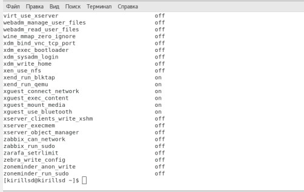
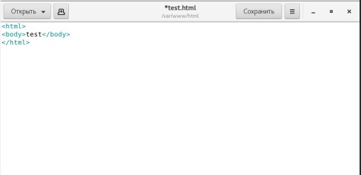
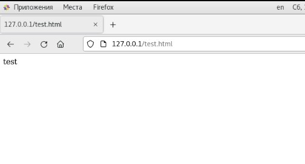
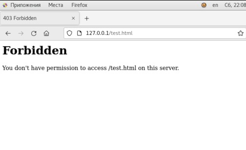
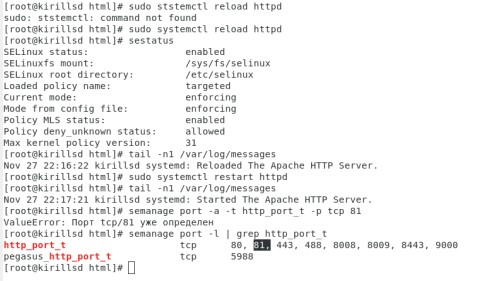
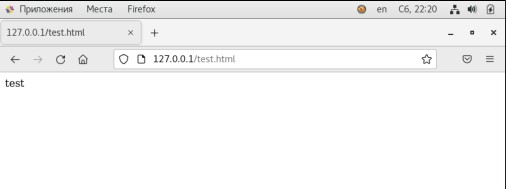

---
## Front matter
lang: ru-RU
title: Лабораторная работа №6
author: |
	Сидоракин
institute: |
	 RUDN University, Moscow, Russian Federation
date: Ноябрь, 2021 Москва

## Formatting
toc: false
slide_level: 2
theme: metropolis
sansfont: NotoMono-Regular
header-includes: 
 - \metroset{progressbar=frametitle,sectionpage=progressbar,numbering=fraction}
 - '\makeatletter'
 - '\beamer@ignorenonframefalse'
 - '\makeatother'
aspectratio: 43
section-titles: true
---
## Цель лабораторной работы

Развить навыки администрирования ОС Linux. Получить первое практическое знакомство с технологией SELinux1. Проверить работу SELinx на практике совместно с веб-сервером Apache.

## Проверяем, что SELinux работает в режиме enforcing политики targeted.
{ #fig:001 width=40% }

## Убеждаемся, что веб-браузер работает.
{ #fig:002 width=50% }

## Найходим веб-сервер Apache в списке процессов
{ #fig:003 width=50% }

## Смотрим состояние переключателей SELinux для Apache 
{ #fig:003 width=50% }

## Определяем тип файлов и поддиректорий, находящихся в директории "/var/www"
{ #fig:004 width=50% }

## Cоздаем от имени суперпользователя html-файл "/var/www/html/test.html"
{ #fig:007 width=50% }

## Содержание файла
{ #fig:007 width=50% }

## Вводим в браузере адрес "http://127.0.0.1/test.html"
{ #fig:007 width=50% }

## Изучаем справку man httpd_selinux
{ #fig:007 width=50% }

## Изменяем контекст файла "/var/www/html/test.html"
{ #fig:007 width=50% }

## Попробуем ещё раз получить доступ к файлу 
{ #fig:007 width=50% }

## Выполняем перезапуск веб-сервера Apache
{ #fig:007 width=50% }

## Выполняем команду "semanage port -a -t http_port_t -р tcp 81"
{ #fig:007 width=50% }

## Верните контекст httpd_sys_cоntent__t и пробуем получить доступ к файлу через веб-сервер.
{ #fig:007 width=50% }

## Удаляем файл test.html: rm "/var/www/html/test.html"
{ #fig:007 width=50% }

## Вывод
В результате выполнения лабораторной работы мы развили навыки администрирования ОС Linux. Получили первое практическое знакомство с технологией SELinux1. Проверили работу SELinx на практике совместно с веб-сервером Apache.