---
# Front matter
title: "Лабораторнаяработа № 6"
subtitle: "Мандатное разграничение прав в Linux "
author: "Сидоракин Кирилл Вячеславович НБибд-01-18"

# Generic otions
lang: ru-RU
toc-title: "Содержание"

# Bibliography
bibliography: bib/cite.bib
csl: pandoc/csl/gost-r-7-0-5-2008-numeric.csl

# Pdf output format
toc: true # Table of contents
toc_depth: 2
lof: true # List of figures
lot: true # List of tables
fontsize: 12pt
linestretch: 1.5
papersize: a4
documentclass: scrreprt
## I18n
polyglossia-lang:
  name: russian
  options:
	- spelling=modern
	- babelshorthands=true
polyglossia-otherlangs:
  name: english
### Fonts
mainfont: PT Serif
romanfont: PT Serif
sansfont: PT Sans
monofont: PT Mono
mainfontoptions: Ligatures=TeX
romanfontoptions: Ligatures=TeX
sansfontoptions: Ligatures=TeX,Scale=MatchLowercase
monofontoptions: Scale=MatchLowercase,Scale=0.9
## Biblatex
biblatex: true
biblio-style: "gost-numeric"
biblatexoptions:
  - parentracker=true
  - backend=biber
  - hyperref=auto
  - language=auto
  - autolang=other*
  - citestyle=gost-numeric
## Misc options
indent: true
header-includes:
  - \linepenalty=10 # the penalty added to the badness of each line within a paragraph (no associated penalty node) Increasing the value makes tex try to have fewer lines in the paragraph.
  - \interlinepenalty=0 # value of the penalty (node) added after each line of a paragraph.
  - \hyphenpenalty=50 # the penalty for line breaking at an automatically inserted hyphen
  - \exhyphenpenalty=50 # the penalty for line breaking at an explicit hyphen
  - \binoppenalty=070 # the penalty for breaking a line at a binary operator
  - \relpenalty=050 # the penalty for breaking a line at a relation
  - \clubpenalty=150 # extra penalty for breaking after first line of a paragraph
  - \widowpenalty=150 # extra penalty for breaking before last line of a paragraph
  - \displaywidowpenalty=50 # extra penalty for breaking before last line before a display math
  - \brokenpenalty=010 # extra penalty for page breaking after a hyphenated line
  - \predisplaypenalty=10000 # penalty for breaking before a display
  - \postdisplaypenalty=0 # penalty for breaking after a display
  - \floatingpenalty = 20000 # penalty for splitting an insertion (can only be split footnote in standard LaTeX)
  - \raggedbottom # or \flushbottom
  - \usepackage{float} # keep figures where there are in the text
  - \floatplacement{figure}{H} # keep figures where there are in the text
  - \usepackage{rotating}
  - \usepackage{tabularx}
---

# Цель работы

Развить навыки администрирования ОС Linux. Получить первое практическое знакомство с технологией SELinux1. Проверить работу SELinx на практике совместно с веб-сервером Apache.

# Выполнение лабораторной работы

C помощью команд getenforce и sestatus проверяем, что SELinux работает в режиме enforcing политики targeted.
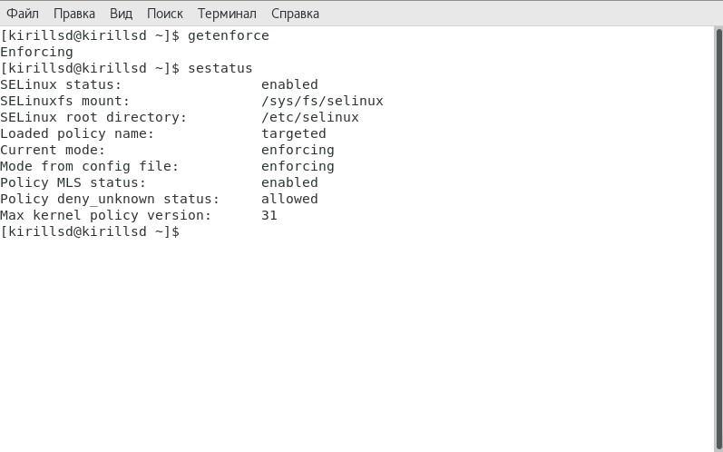{ #fig:001 width=50% }

Обращаемся помощью браузера к веб-серверу и убеждаемся, что последний работает.
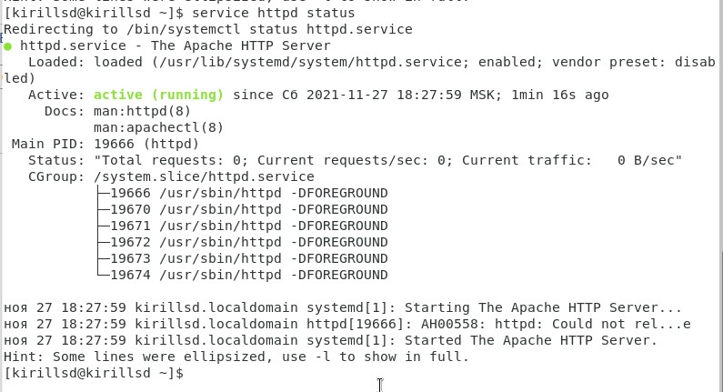{ #fig:002 width=50% }

Найходим веб-сервер Apache в списке процессов
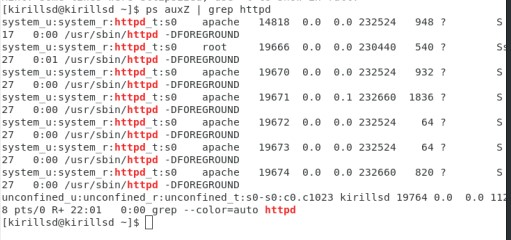{ #fig:003 width=50% }

Смотрим текущее состояние переключателей SELinux для Apache 
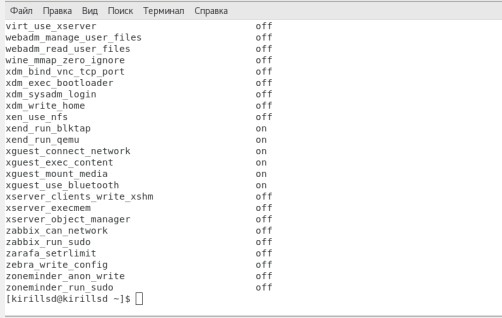{ #fig:003 width=50% }

Определяем тип файлов и поддиректорий, находящихся в директории "/var/www"
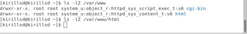{ #fig:004 width=50% }

Cоздаем от имени суперпользователя html-файл "/var/www/html/test.html"
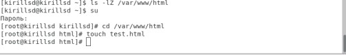{ #fig:007 width=50% }

Содержание файла
{ #fig:007 width=50% }

Вводим в браузере адрес "http://127.0.0.1/test.html"
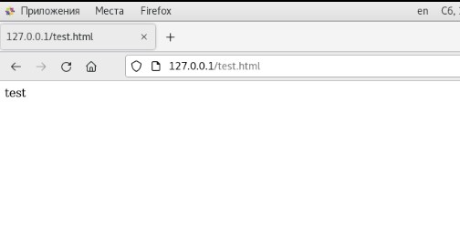{ #fig:007 width=50% }

Изучаем справку man httpd_selinux
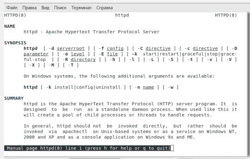{ #fig:007 width=50% }

Изменяем контекст файла "/var/www/html/test.html"
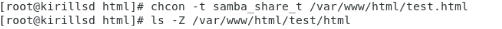{ #fig:007 width=50% }

Попробуем ещё раз получить доступ к файлу через веб-сервер
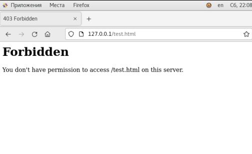{ #fig:007 width=50% }

Выполняем перезапуск веб-сервера Apache
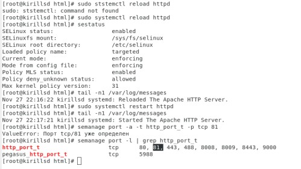{ #fig:007 width=50% }

Выполняем команду "semanage port -a -t http_port_t -р tcp 81"
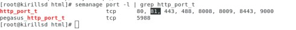{ #fig:007 width=50% }

Верните контекст httpd_sys_cоntent__t и пробуем получить доступ к файлу через веб-сервер.
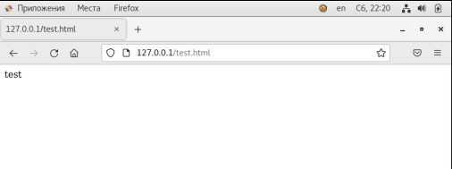{ #fig:007 width=50% }

Удаляем файл test.html: rm "/var/www/html/test.html"
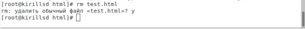{ #fig:007 width=50% }

# Вывод

В результате выполнения лабораторной работы мы развили навыки администрирования ОС Linux. Получили первое практическое знакомство с технологией SELinux1. Проверили работу SELinx на практике совместно с веб-сервером Apache.
